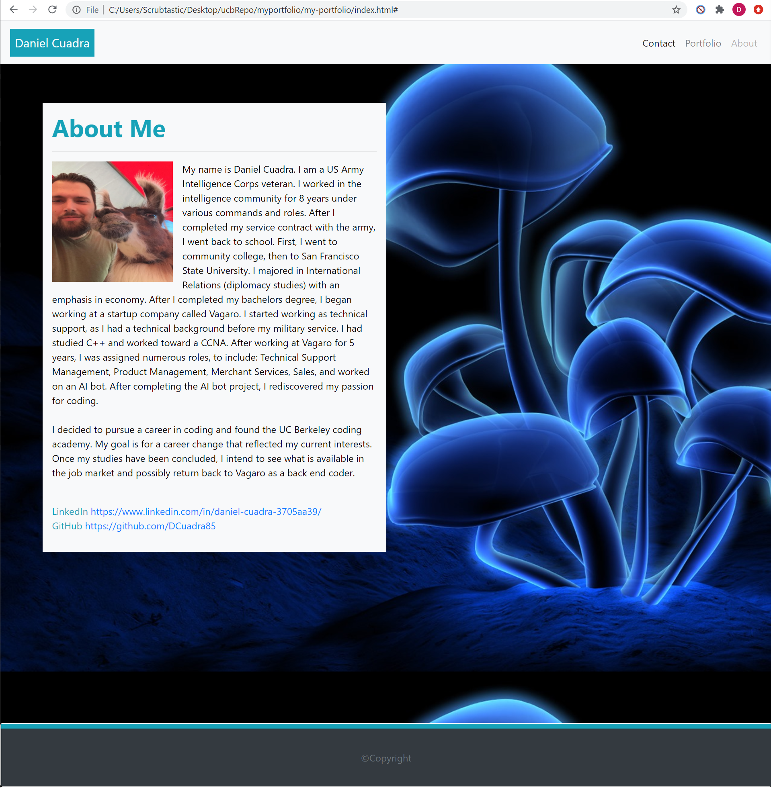
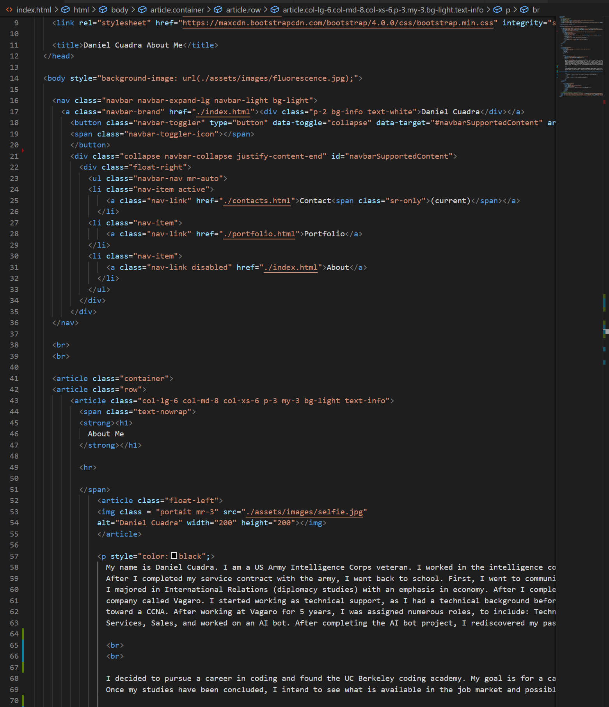
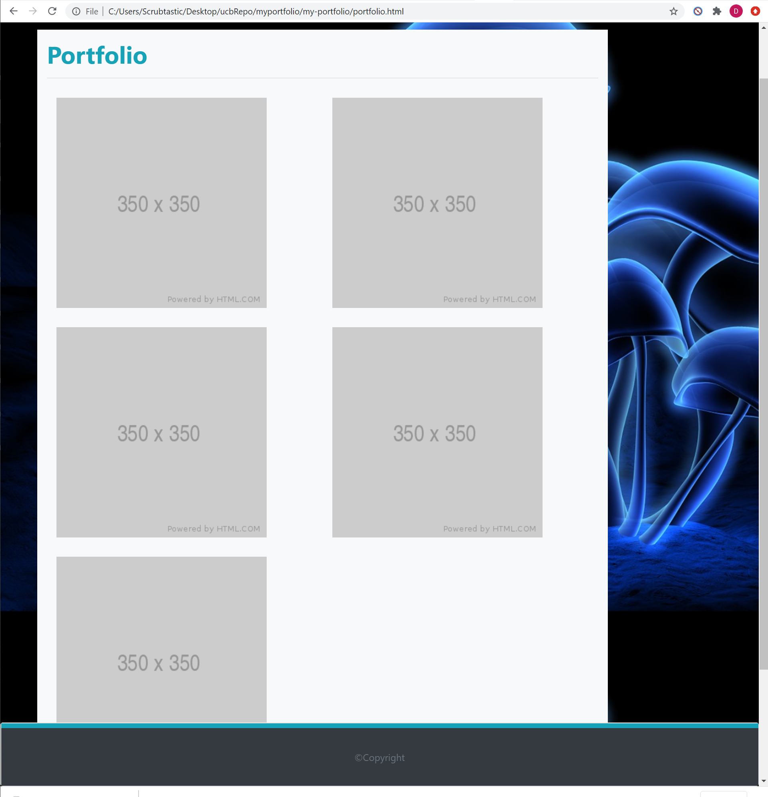
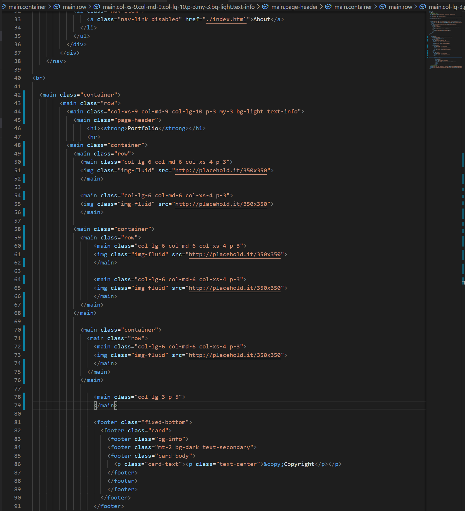
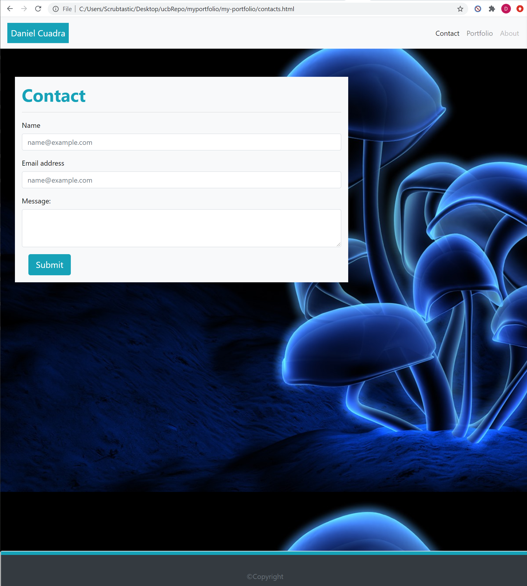
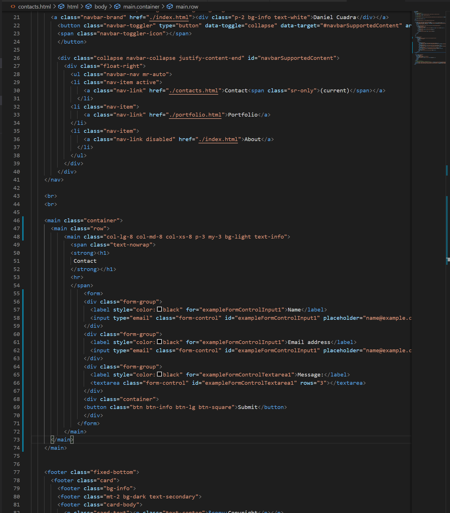

# My Portfolio

A portfolio page was created using Bootstrap with HTML/CSS. This portfolio is cenetered around the author, Daniel Cuadra. The goal was to create a function webpage using a NavBar, grid system, form intake, and semantic HTML. This is to include function links between pages and to establish a layout for future showcase of projects. 

* Use of Bootstrap.
* Scaling grids.
* Responsive images.
* Use of semantic HTML tags.

## Usage

The entirety of the pages for this read me were created using BootStrap with personal adjustments to the HTML, with exception to the reset.css file. The reset file was used to ensure all browsers load the code the same. The first visible feature across all pages is the NavBar. This encompasses the links between each page and is uniform across all pages. By default, you will see the index (about me) page to begin when you go to the deployment page. At the bottom of each page, there will be a sticky footer, which is also universal across each page. The body of each page will vary based on the subject of the page. The first screenshot will be of the index page with the about me section and related social media links. The second screenshot will give a general look at the code of the navbar and body.

The second page is the portfolio page, which is currently using a grid system and image place holder until relevant projects can be linked. The images are responsive to the scale and will collapse when the width is reduced. The first image is a view of the portfolio page, the second is of the body of the code and footer.

The contact page has the same universal code as the previous two pages. The main section of this page uses an adjusted bootstrap form function within a grid.

## Credits

* https://github.com/coding-boot-camp/
* https://www.w3schools.com/
* https://stackoverflow.com/questions/
* https://guides.github.com/features/mastering-markdown/
* https://getbootstrap.com/
* https://developer.mozilla.org/en-US/docs/Web/HTML/
* https://www.digitalblasphemy.com/

## Built With

* [HTML](https://developer.mozilla.org/en-US/docs/Web/HTML)
* [CSS](https://developer.mozilla.org/en-US/docs/Web/CSS)
* [BootStrap](https://getbootstrap.com/)

## Deployed Link

* https://dcuadra85.github.io/my-portfolio/

## Authors

* **Daniel Cuadra** 

- [GitHub](https://github.com/DCuadra85)
- [LinkedIn](https://www.linkedin.com/in/daniel-cuadra-3705aa39/)

## License

MIT License

Copyright (c) [2020] [DanielCuadra]

Permission is hereby granted, free of charge, to any person obtaining a copy
of this software and associated documentation files (the "Software"), to deal
in the Software without restriction, including without limitation the rights
to use, copy, modify, merge, publish, distribute, sublicense, and/or sell
copies of the Software, and to permit persons to whom the Software is
furnished to do so, subject to the following conditions:

The above copyright notice and this permission notice shall be included in all
copies or substantial portions of the Software.

THE SOFTWARE IS PROVIDED "AS IS", WITHOUT WARRANTY OF ANY KIND, EXPRESS OR
IMPLIED, INCLUDING BUT NOT LIMITED TO THE WARRANTIES OF MERCHANTABILITY,
FITNESS FOR A PARTICULAR PURPOSE AND NONINFRINGEMENT. IN NO EVENT SHALL THE
AUTHORS OR COPYRIGHT HOLDERS BE LIABLE FOR ANY CLAIM, DAMAGES OR OTHER
LIABILITY, WHETHER IN AN ACTION OF CONTRACT, TORT OR OTHERWISE, ARISING FROM,
OUT OF OR IN CONNECTION WITH THE SOFTWARE OR THE USE OR OTHER DEALINGS IN THE
SOFTWARE.